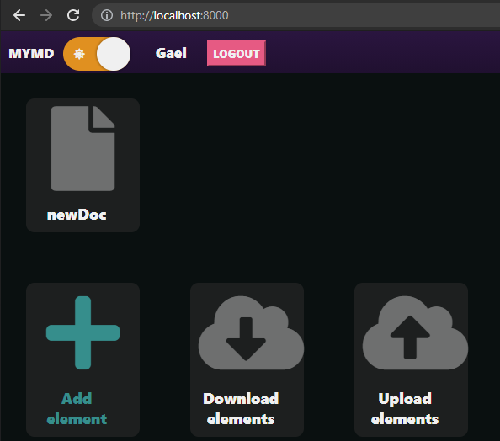
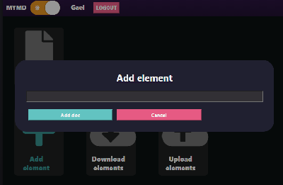
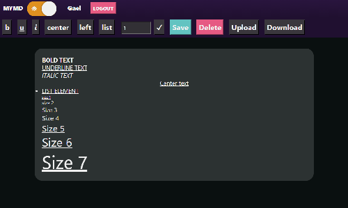

# MYMDITOR

## WHAT IS IT?

It is a personal project made with *django*, *javascript* and *sass* that I have been working on for a few weeks.

I made it with the goal of made a **text editor** of markdown files, but that function doesn't works yet and i should work on it in a future

---
## HOW TO USE IT ?

my project doesn't have many functions so its easy to use

* ### **INDEX**

    

    * Click to "MYMD" to go to index page

    * Click in the switch to change the style of the page

    * Click on a document to open it, each document will look like "newDoc" element

    * Click into "Add element" to add a new element, it will display the next modal
        

        Then, you only need to write the document name and click on "Add doc" button

    * Click on "Download elements" to download all from user cloud *you must log in before*

    * Click on "Upload elements" to update all elements from user cloud  *you must log in before*

* ### **DOC VIEW**

    

    * Click to "MYMD" to go to index page

    * Click in the switch to change the style of the page

    * Select text and click in "b" for get bold text, "u" to get underline text, "i" to get italic text, "center" to center an element, "left" to align the element to left and "list" to create a unordered list

    * If you want to change the size of then text only select the text size (1-7) in the number input box, select the text and click on "✓"

    * Click on "Save" to save the document and "Delete" to delete it from local storage

    * Click on "Upload" to update this document on user cloud *you must log in before*

    * Click on "Download" to get the document from user cloud *you must log in before* 


---

## HOW CONFIGURE THE ENVIRONMENT? 

Just do the following steps:

1. Config your virtual environment

    + Execute the next's commands
        ```cmd
        pip install pipenv
        pipenv shell
        pipenv sync
        ```


2. Config the database

    + Go to ./mymd/mymd/settings.py

    + Change database settings in line 77      
        ```python
            DATABASES = {
                'default': {
                'ENGINE': 'django.db.backends.sqlite3',
                'NAME': BASE_DIR / 'db.sqlite3',
                }
            }
        ```

    + Make migrations 
        ```cmd
        cd ../
        python manage.py makemigrations
        python manage.py migrate
        ```
    
3. Start server 

    + In ./mymd/
        ```cmd
        python manage.py runserver
        ```

---

## HOW IT WORKS ?

Ok, i don't know what should i write here, but i'll write some annotations here

+ **static files** ./mymd/static/

    + **js/**

        + Each template calls an index and that happens

            1. In index import each required script

                Example of genericIndex: 
                ```javascript
                // Import all required scrips
                import Switch_mode from "./switch-mode.js";
                import Model from "./model.js";

                document.addEventListener("DOMContentLoaded", function () {
                    // Set all requirements for a basic view

                    console.log("Dom content loaded");
                    const switchMode = new Switch_mode();
                    const model = new Model();

                    switchMode.setModel(model);
                });
                ````

            2. Each script exports an class that will contain the required tools to work

                * ### model.js
                    This script export all tools for **create, read, update and delete** elements and data of the **local storage**

                * ### docView.js, indexViews.js
                    Views manage all the **functions of the view**, buttons, events and whatever that will be necessary for the app

                * ### switch-mode.js
                    Switch-mode.js manage if the page will **use dark style or not**

                * ### docEdit.js
                    docEdit.js just creates **event listeners** required for the **edition of an element value**

                * ### logout.js
                    **Just delete all local storage** values when you log out of your user

                * ### urls.js
                    urls.js just export all tools required for **create and interpret an url**

                * ### ajaxModel.js
                    ajaxModel.js is a model to **request post to update user cloud** data

                * ### alerts.js
                    alerts.js will manage all **alerts display**, these alerts will appear instantly, but if a promise is given, the alert will be deleted when the promise will be resolved.

                    Perfect for alert about the status of post, like download or upload

                    If a promise isn't given, the alert will be deleted after a little delay.
                    
                    In both cases, an element should be in a corner, the alert will be deleted when you click it.

                * ***FOR MORE INFORMATION, I WRITTEN DETAILED INFORMATION ABOUT THE OPERATION OF THE SCRIPT IN THE COMMENTS OF EACH FILE***

    + **scss/**

        + index.scss only create variables and functions for the operation of imports

        + sections/ will save all required import for index.scss

            + **_content** save all in reference to content boxes and import all personalized content scss files
                + **docView/, index/** just contain a file that will save an style that will only used on a specific page

            + **_footer** saves all in reference to footer

            + **_forms** saves all in reference to forms, inputs and buttons

            + **_index** saves all in reference to general tags that will be used anywhere

            + **_modal** saves all in reference to modals

            + **_nav** saves all in reference to nav and what it content


    + **css/**

        + Just don't move anything, is better work css file with sass compiler 

+ **views**

    + docs/views.py

        + docView receives 0 values and it will return the docView.html template

        + download post method receives 1 value, these will be:

            1. dataDir: A list that will contain the required keys to locate the element in user cloud data

            *download post method just return a jsonResponse with the values of the requested data of the user cloud*

        + upload post method receives 2 values, these will be:

            1. dataDir: A list that will contain the required keys to locate the element in user cloud data

            2. dataValue: a json element that will contain the new data that will update requested user cloud data

            *upload post method just return a jsonResponse with the status of the upload*

    + mymd/views.py

        + index get method just return index.html template

        + register get method return a sign in form in register.html and get method receives 3 values, that will be:

            1. username as string

            2. email as email

            3. password as password

            *These values will be used to create a new account and then ctrates the user cloud*

---
## WHO AM I?

I don't know, im only a preparatory student that likes to program

*Im new into programming, i just do it as a hobby, please **don't take this project as a serious and useful project***

My email is : **gaeldev032@gmail.com**